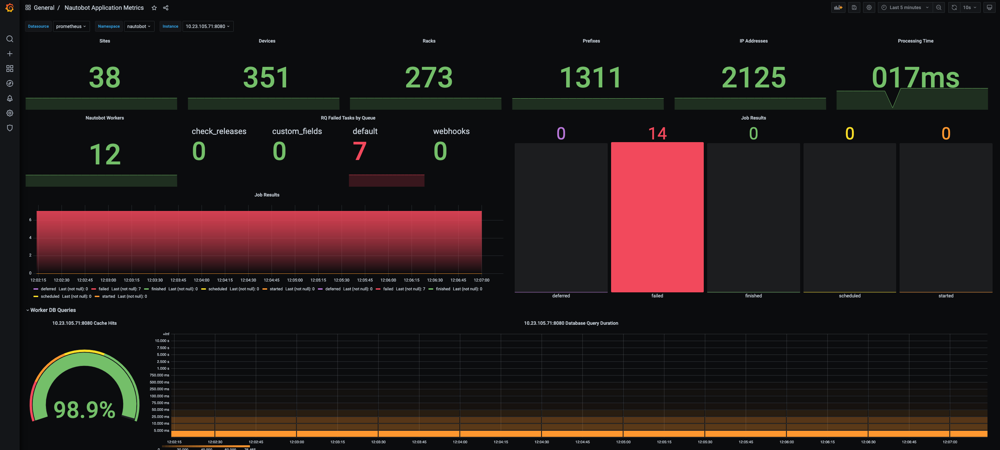

# Using the App

This document describes common use-cases and scenarios for this App.

## General Usage

Configure your Prometheus server to collect the application metrics at `/api/plugins/capacity-metrics/app-metrics/`

```yaml
# Sample prometheus configuration
scrape_configs:
  - job_name: 'nautobot_app'
    scrape_interval: 120s
    metrics_path: /api/plugins/capacity-metrics/app-metrics
    static_configs:
      - targets: ['nautobot']
  - job_name: 'nautobot_queue'
    scrape_interval: 20s
    metrics_path: /api/plugins/capacity-metrics/rq-metrics
    static_configs:
      - targets: ['nautobot']
```

### RQ Worker Metrics Endpoint

This plugin adds a new django management command `rqworker_metrics` that is behaving identically to the default `rqworker` command, except that this command also exposes a Prometheus endpoint (default port 8001).

With this endpoint it become possible to instrument the tasks running asyncronously in the worker.

The new command needs to be executed on the worker as a replacement for the default `rqworker`:

```shell
nautobot-server rqworker_metrics
```

The port used to expose the Prometheus endpoint can be configured for each worker in CLI:

```shell
nautobot-server rqworker_metrics --prom-port 8002
```

Since the `rq-worker` is based on a fork model, for this feature to work it's required to use Prometheus in multi-process mode. To enable this mode the environment variable `prometheus_multiproc_dir` must be defined and point at a valid directory.


## Use-cases and common workflows

### Default Metrics for the application metrics endpoint

The following metrics will be provided via the `/api/plugins/capacity-metrics/app-metrics` endpoint:

```no-highlight
# HELP nautobot_gitrepository_task_stats Per Git repository task statistics
# TYPE nautobot_gitrepository_task_stats gauge
nautobot_gitrepository_task_stats{module="repo1",name="main",status="success"} 1.0
nautobot_gitrepository_task_stats{module="repo1",name="main",status="warning"} 0.0
nautobot_gitrepository_task_stats{module="repo1",name="main",status="failure"} 0.0
nautobot_gitrepository_task_stats{module="repo1",name="main",status="info"} 6.0
nautobot_gitrepository_task_stats{module="repo1",name="total",status="success"} 1.0
nautobot_gitrepository_task_stats{module="repo1",name="total",status="warning"} 0.0
nautobot_gitrepository_task_stats{module="repo1",name="total",status="failure"} 0.0
nautobot_gitrepository_task_stats{module="repo1",name="total",status="info"} 6.0
# HELP nautobot_gitrepository_execution_status Git repository completion status
# TYPE nautobot_gitrepository_execution_status gauge
nautobot_gitrepository_execution_status{module="repo1",status="pending"} 0.0
nautobot_gitrepository_execution_status{module="repo1",status="running"} 0.0
nautobot_gitrepository_execution_status{module="repo1",status="completed"} 1.0
nautobot_gitrepository_execution_status{module="repo1",status="errored"} 0.0
nautobot_gitrepository_execution_status{module="repo1",status="failed"} 0.0
# HELP nautobot_job_task_stats Per Job task statistics
# TYPE nautobot_job_task_stats gauge
nautobot_job_task_stats{module="local/users/CheckUser",name="total",status="success"} 1.0
nautobot_job_task_stats{module="local/users/CheckUser",name="total",status="warning"} 0.0
nautobot_job_task_stats{module="local/users/CheckUser",name="total",status="failure"} 0.0
nautobot_job_task_stats{module="local/users/CheckUser",name="total",status="info"} 0.0
nautobot_job_task_stats{module="local/users/CheckUser",name="test_is_uppercase",status="success"} 1.0
nautobot_job_task_stats{module="local/users/CheckUser",name="test_is_uppercase",status="warning"} 0.0
nautobot_job_task_stats{module="local/users/CheckUser",name="test_is_uppercase",status="failure"} 0.0
nautobot_job_task_stats{module="local/users/CheckUser",name="test_is_uppercase",status="info"} 0.0
# HELP nautobot_job_execution_status Job completion status
# TYPE nautobot_job_execution_status gauge
nautobot_job_execution_status{module="local/users/CheckUser",status="pending"} 0.0
nautobot_job_execution_status{module="local/users/CheckUser",status="running"} 0.0
nautobot_job_execution_status{module="local/users/CheckUser",status="completed"} 1.0
nautobot_job_execution_status{module="local/users/CheckUser",status="errored"} 0.0
nautobot_job_execution_status{module="local/users/CheckUser",status="failed"} 0.0
# HELP nautobot_model_count Per Nautobot Model count
# TYPE nautobot_model_count gauge
nautobot_model_count{app="dcim",name="Site"} 24.0
nautobot_model_count{app="dcim",name="Rack"} 24.0
nautobot_model_count{app="dcim",name="Device"} 46.0
nautobot_model_count{app="ipam",name="IPAddress"} 58.0
nautobot_model_count{app="ipam",name="Prefix"} 18.0
nautobot_model_count{app="extras",name="GitRepository"} 1.0
# HELP nautobot_app_metrics_processing_ms Time in ms to generate the app metrics endpoint
# TYPE nautobot_app_metrics_processing_ms gauge
nautobot_app_metrics_processing_ms 59.48257
```

### Default Metrics for the `RQ` Worker metrics endpoint

The following metrics will be provided via the `/api/plugins/capacity-metrics/rq-metrics` endpoint:

```no-highlight
# HELP nautobot_queue_number_jobs Number of Job per RQ queue and status
# TYPE nautobot_queue_number_jobs gauge
nautobot_queue_number_jobs{name="check_releases",status="finished"} 0.0
nautobot_queue_number_jobs{name="check_releases",status="started"} 0.0
nautobot_queue_number_jobs{name="check_releases",status="deferred"} 0.0
nautobot_queue_number_jobs{name="check_releases",status="failed"} 0.0
nautobot_queue_number_jobs{name="check_releases",status="scheduled"} 0.0
nautobot_queue_number_jobs{name="default",status="finished"} 0.0
nautobot_queue_number_jobs{name="default",status="started"} 0.0
nautobot_queue_number_jobs{name="default",status="deferred"} 0.0
nautobot_queue_number_jobs{name="default",status="failed"} 0.0
nautobot_queue_number_jobs{name="default",status="scheduled"} 0.0
# HELP nautobot_queue_number_workers Number of worker per queue
# TYPE nautobot_queue_number_workers gauge
nautobot_queue_number_workers{name="check_releases"} 0.0
nautobot_queue_number_workers{name="default"} 2.0
# HELP nautobot_rq_metrics_processing_ms Time in ms to generate the app metrics endpoint
# TYPE nautobot_rq_metrics_processing_ms gauge
nautobot_rq_metrics_processing_ms 33.34308
```

### Add your own metrics

Read about how to add you own custom metrics [here](../dev/extending.md).

## Screenshots

Example [Grafana Dashboard](https://github.com/nautobot/nautobot-plugin-capacity-metrics/blob/develop/examples/nautobot_grafana_dashboard.json).


